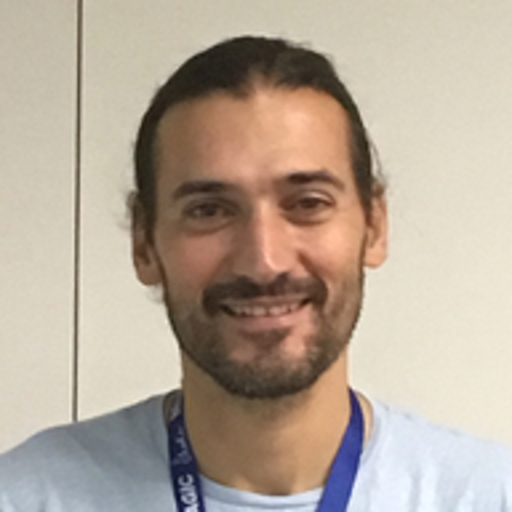
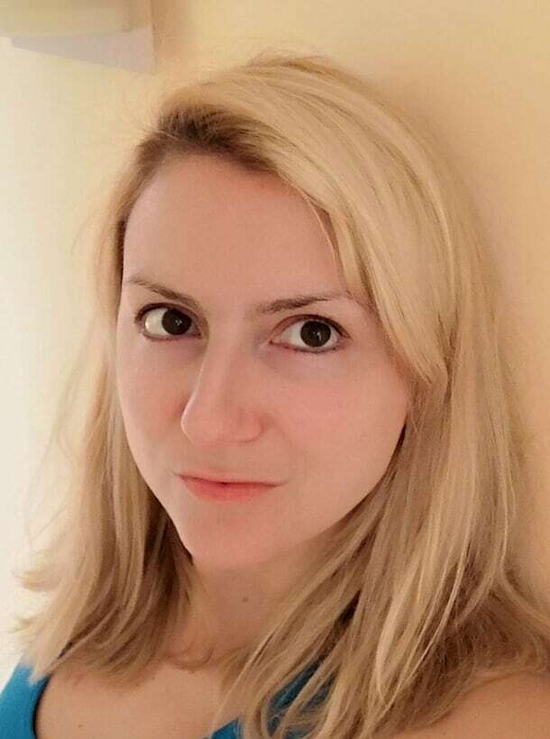

 

## What do We Do
Our InfoSec Team is one of the most fast paced and growing teams in Glasswall. A very new team set up in 2020 with the purpose of protecting Glasswall's assets and customers along with building cyber resilience. We are a highly proactive, responsive and effective team. Made our of Abbas, Petra and an Upwork bank of brilliant and skilled penetration testers and AppSec engineers. We deal with Cloud Security, Security Awerness Training, Network Security, Incident Response and SOC activities, Application Security, Penetration Testing and also Risk and Data Privacy Management. We take cyber security seriously in Glasswall, therefore we founded the Security Champions Programme to ensure information security is part of every workflow. 

## Team Members

**Abbas Haidar  - Head of IT and InfoSec**

The Glasswall InfoSec Team founder, Abbas Haidar, joined Glasswall with a vision. He build the skeleton of our office Network Security System and the foundations of our operational information security. Now he is leading the way of Glasswall's cyber risk resilliance. Coming from a strong IT background he specialises in cryptography (Msc in Cryptography) and his interests are in risk management and data and privacy protection. 

**Dinis Cruz - CISO and CTO**

Dinis Cruz a highly experienced developer and cyber security expert is our CISO and CTO. This position gives Glasswall the opportunity to handle security as an enabler of operations. He brings in energy and innovation to Glasswall always raising the bar in security standards. Being an ethical hacker and developer gives Dinis a unique set of technical skills which Glasswall can benfit from. He uses the Wardley Maps methodology to reform an innovate the Glasswall's teams structure and ensure that security is incorporated in a DevSecOps manner into Glasswall's operations. Dinis was nominated for CISO of the Year 2019 at #CyberSecurityAwards.

**Dr Petra Vukmirovic - InfoSec Team Squad Leader**

Petra joined our team in March 2020 coming from a medical background in the middle of a pandemic. She is just completing her MSc in Information Security and Digital Forensics - a Wardley maps enthusiast and machine learning geek, she started off as an intern (Productivity Engineer) in Glasswall. She soon proved her title as cyber security engineer. From the medical world she brough in a freshness, hard work and diligence along with proactivity and situational awerness. She is leading the way in researching the use of machine learning and CDR in our company and was a speaker on the OWASP Open Security Summit and Simon Wardley Map Camp. 
