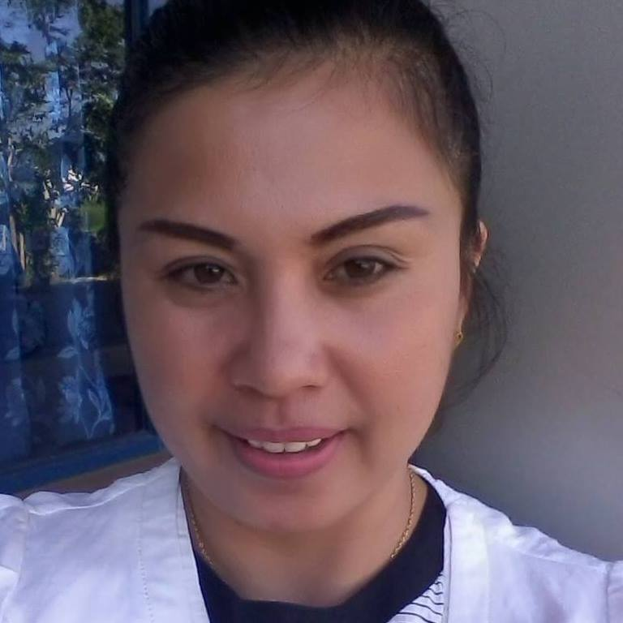

## Team Activities

In Glasswall our IT team is made out of remarkable and skilled individuals who create, maintain and monitor complex cloud and on-prem solutions, systems and processes. The team is also in charge of distaster recovery planning, business continuity and therefore it is the team that keeps Glasswall running and in business. This whole system is under the eye of the Head of IT and InfoSec Abbas Haidar who coordinates and delegates the above mentioned tasks and processes (checkout Abbas' bio under the InfoSec Team section). 

## Team Members

**Tom Nixon - IT Team Squad Leader**

The IT Squad Leader and Senior System admin joined Glasswall as a Technical Support Engineer just over a year ago. Tom brings with him years of experience & IT knowledge working with many different companies ranging from 10 users to companies with over 2000 users. With his pro-activity, resourcefulness and hard work quickly he demonstrated his leadership potential and earned the title of Squad Leader. Tom has a wide range of knowledge and is always quick to learn the new and up and coming technologies to implement into the Glasswall Tech stack.

**Alona Reyes - IT Support, Project Management and System Admin**

Our versatile Alona holds a BS in Comuter science and has joined us in Glasswall from Upwork. Very quickly with ease integrated in our Team. Her attention to detail keeps our processes going on a daily basis. Alona is also involved in InfoSec processes in regards to incident response and SOC (Security Operations Centre) alerts. After spending months with Glasswall, Alona knows what truly drives the Infosec/IT team to perform its best — and it's not mastering the flavor of  the week. It's how well you connect with the heart-beating people you're trying to help and communicate your understanding back to them. Alona has landed a series of project management jobs in Upwork for multimillion dollar brands and startups. In addition to her extensive project management experience, Alona is a trained recruiter also and on her way to be a InfoSec/IT enthusiast. 